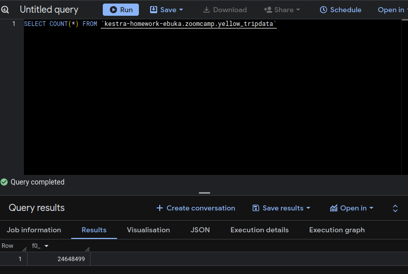
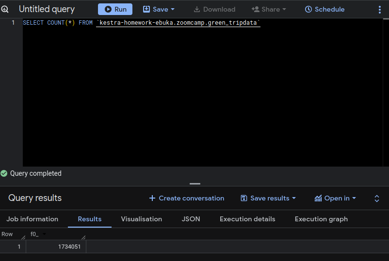

## Module 2 Homework

For the homework, we'll be working with the _green_ taxi dataset located here:

`https://github.com/DataTalksClub/nyc-tlc-data/releases/tag/green/download`

To get a `wget`-able link, use this prefix (note that the link itself gives 404):

`https://github.com/DataTalksClub/nyc-tlc-data/releases/download/green/`

### Assignment

So far in the course, we processed data for the year 2019 and 2020. Your task is to extend the existing flows to include data for the year 2021.

For this, I leveraged the backfill functionality in the [flows](./flows/zoomcamp-homework-gcp_taxi_scheduled.yaml) to backfill the data for the year 2021. Before this, I 
* created a new project on google cloud
* Created a service account for this project and gave it the right permissions
* Created a json key which I renamed to `service-account.json`
* encoded this json key to a `base64` object using the command below:
```
echo SECRET_GCP_SERVICE_ACCOUNT=$(cat service-account.json | base64 -w 0) >> .env_encoded 
```
* I then added this line of code to my `docker-compose` file (just after the volumes)
```
    env_file: 
      - .env_encoded
```
I also created a project here `https://aistudio.google.com/` and then I created a key to enable AI while using kestra. I ran this command to add the key to my environment variable:
```
export GEMINI_API_KEY="your-key-here" 
```

Then I added the line of code below to my `docker-compose` file
```
        ai:
            type: gemini
            gemini:
              model-name: gemini-2.5-flash
              api-key: "${GEMINI_API_KEY}"
```
This was added jsut after `queue` section uder `KESTRA_CONFIGURATION`

I saved my file and ran `docker compose up`

I then logged into kestra via `http://localhost:8080/`

## Setting Up my Environments using Flows
To set up my environments and variables for easier running, I first ran the workflow here [flows](./flows/zoomcamp-homework-gcp_kv.yaml)

Then I ran the flow here [flows](./flows/zoomcamp-homework-gcp_setup.yaml) to set up my google cloud bucket

### Quiz Questions

Complete the quiz shown below. It's a set of 6 multiple-choice questions to test your understanding of workflow orchestration, Kestra, and ETL pipelines.

1) Within the execution for `Yellow` Taxi data for the year `2020` and month `12`: what is the uncompressed file size (i.e. the output file `yellow_tripdata_2020-12.csv` of the `extract` task)?
- 128.3 MiB ✅
- 134.5 MiB
- 364.7 MiB
- 692.6 MiB

In the output after running the backfill, the output for the uncompressed file was `134,481,400` bytes which translates to 128.25 MiB or Mebibytes. This was gotten via 
```
134,481,400 bytes / 1,048,576 
```

2) What is the rendered value of the variable `file` when the inputs `taxi` is set to `green`, `year` is set to `2020`, and `month` is set to `04` during execution?
- `{{inputs.taxi}}_tripdata_{{inputs.year}}-{{inputs.month}}.csv` 
- `green_tripdata_2020-04.csv` ✅
- `green_tripdata_04_2020.csv`
- `green_tripdata_2020.csv`

3) How many rows are there for the `Yellow` Taxi data for all CSV files in the year 2020?
- 13,537.299
- 24,648,499 ✅
- 18,324,219
- 29,430,127



4) How many rows are there for the `Green` Taxi data for all CSV files in the year 2020?
- 5,327,301
- 936,199
- 1,734,051 ✅
- 1,342,034



5) How many rows are there for the `Yellow` Taxi data for the March 2021 CSV file?
- 1,428,092
- 706,911
- 1,925,152
- 2,561,031


6) How would you configure the timezone to New York in a Schedule trigger?
- Add a `timezone` property set to `EST` in the `Schedule` trigger configuration  
- Add a `timezone` property set to `America/New_York` in the `Schedule` trigger configuration ✅
- Add a `timezone` property set to `UTC-5` in the `Schedule` trigger configuration
- Add a `location` property set to `New_York` in the `Schedule` trigger configuration  

## Submitting the solutions

* Form for submitting: https://courses.datatalks.club/de-zoomcamp-2026/homework/hw2
